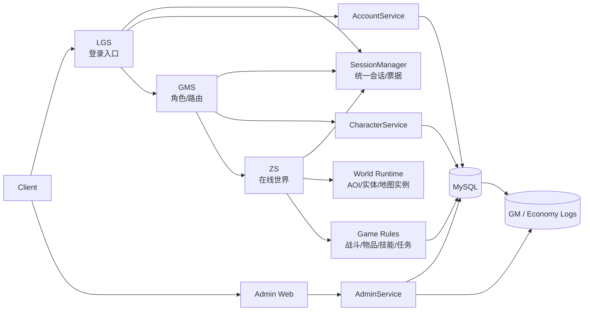

# Laghaim Go 架构基线

## 目标

把当前 Python 参考仓库拆成可以长期维护的 5 个边界明确的系统：

1. 登录服 LGS
2. 角色/路由服 GMS
3. 区域服 ZS
4. 后台管理 Admin Web
5. 平台支撑层（配置、日志、审计、监控、迁移）

## 核心结论

### 1. 认证链路必须中心化

参考仓库的问题不是“少几个 handler”，而是身份流转没有被建模清楚。

Go 重写中只允许这三类身份在各层流动：

- `account_id`：账号主体
- `session_id`：一次登录会话主体
- `character_id`：进入世界后的角色主体

任何服都不应接受客户端自报 `account_id` / `character_id` 作为授权依据。

### 2. 协议与业务必须彻底拆开

当前 Python 参考中，协议解析、在线状态、业务逻辑、持久化大量混在一起。

Go 重写按四层拆分：

- `internal/protocol/`：帧切分、包头、opcode、结构体编解码
- `internal/session/`：登录会话、ticket、互斥登录、跨服 handoff
- `internal/service/`：账号、角色、进入世界、后台等用例编排
- `internal/repo/`：MySQL 持久化

### 3. 在线态与持久态分离

在线对象只放在内存世界里；数据库只保存可恢复状态和审计事实。

- 在线态：AOI、连接、战斗临时态、广播订阅
- 持久态：账号、角色、背包、装备、技能、任务、仓库、流水、GM 审计

## 服务边界



## 建议目录职责

```text
cmd/
  login-server/      # LGS 进程入口
  game-manager/      # GMS 进程入口
  zone-server/       # ZS 进程入口
  admin-web/         # 后台入口

internal/
  protocol/          # 包头、帧、opcode、编解码
  session/           # ticket、互斥登录、会话状态机
  repo/              # MySQL 仓储
  service/           # 用例编排（登录/选角/进图/后台）
  world/             # 在线对象、AOI、地图实例、广播
  game/              # 战斗、物品、技能、任务、公会等规则
  admin/             # 后台 API / RBAC
  platform/          # config、log、metrics、errors、ratelimit
```

## P0 期内的最小落地形态

### LGS

职责：

- 账号认证
- 创建登录会话
- 下发 GMS ticket
- 提供服务器列表

不负责：

- 角色列表
- 角色删除
- 进入地图

### GMS

职责：

- 验证 LGS ticket
- 查询角色列表
- 创建/删除角色
- 选择角色
- 下发 ZS ticket

不负责：

- 持续世界状态
- AOI 广播
- 战斗

### ZS

职责：

- 验证 ZS ticket
- 创建在线玩家实体
- 地图进入/离开
- AOI、移动广播、NPC 可见
- 断线清理与位置落盘

不负责：

- 账号认证
- 角色创建删除

### Admin Web

职责：

- 账号、角色、封禁、公告、日志查询
- RBAC
- GM 高风险操作审计

## 平台约束

### 配置

- YAML 文件 + 环境变量覆盖
- 不把密钥硬编码进仓库

### 数据库

- MySQL 8 / InnoDB
- 迁移全部通过 `migrations/`
- 高并发对象必须有 `row_version` 或事务保护

### 观测

P0 就要预留：

- 结构化日志
- 连接数/在线人数/地图人数 metrics
- 关键请求失败率
- 审计日志查询入口

## 本阶段不做的设计

暂不为 P0 加入：

- 多世界横向扩展
- 跨大区服务发现
- 邮件、拍卖、攻城战专用子系统
- 复杂分布式一致性

先把单世界、单服组主链路做实。

## 需要持续验证的两点

1. 客户端到底哪些阶段走“文本命令帧”，哪些阶段走“typed binary packet”
2. 传输加密以客户端 `rnpacket.cpp` 为准，优先按 SEED 方向验证；当前 Python 参考中的 XOR 只保留为逆向笔记，不作为主实现前提
