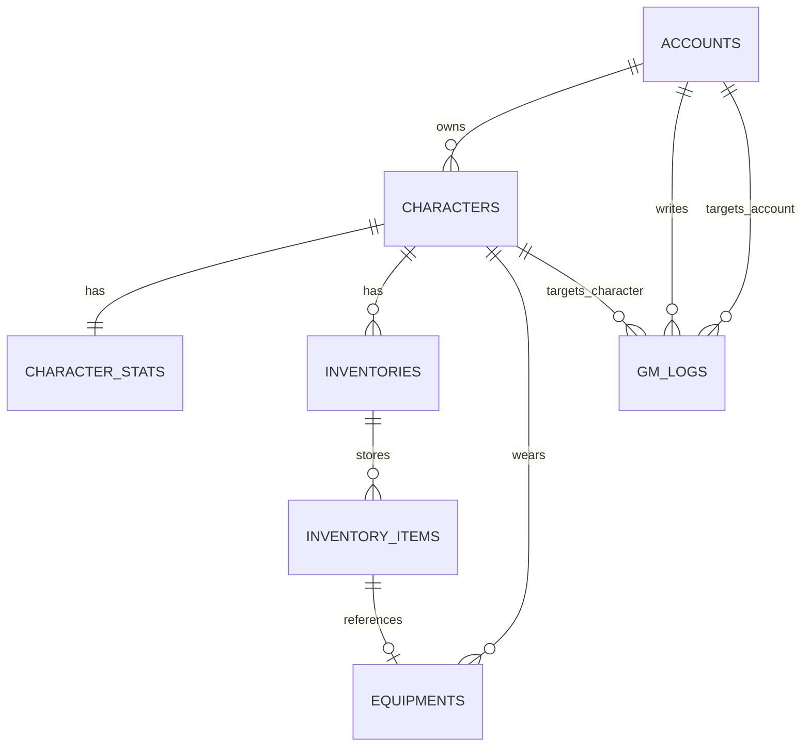

# MySQL 数据库设计

## 设计原则

1. 主数据与实例数据分离
2. 在线态不直接入库
3. 所有经济变更要有流水
4. 所有 GM 操作要有审计
5. 背包/装备/任务等高频对象要有版本控制字段

## P0 基础实体

## 表清单

### `accounts`

用途：账号主表

关键字段：

- `id`
- `username` 唯一
- `password_hash`
- `password_algo`
- `status`
- `gm_role`
- `last_login_at`
- `last_login_ip`

索引：

- `uk_accounts_username`
- `idx_accounts_status`
- `idx_accounts_role`

### `characters`

用途：角色主表，只放跨系统共享的角色事实

关键字段：

- `id`
- `account_id`
- `slot_index`
- `active_slot_index`（生成列，仅未删除角色参与唯一约束，保证软删除后槽位可复用）
- `name` 唯一
- `race / sex / hair`
- `level / experience`
- `map_id / zone_id / pos_x / pos_y / pos_z / direction`
- `money`
- `is_deleted`
- `row_version`

索引：

- `uk_characters_name`
- `uk_characters_account_active_slot`
- `idx_characters_map`

### `character_stats`

用途：可独立更新的数值块

关键字段：

- 五维属性
- `hp/max_hp`
- `mp/max_mp`
- `stamina/max_stamina`
- `epower/max_epower`
- `skill_points`
- `status_points`
- `row_version`

拆分原因：

- 角色基本信息和数值变化频率不同
- 便于用例层按聚合加载

### `inventories`

用途：容器定义，不直接装物品实例

建议类型：

- `bag`
- `quickbar`
- `stash`
- `guild_stash`

P0 migration 先支持角色自有容器。

当前建角初始化会创建：

- `bag`，容量 60。
- `quickbar`，容量 12。

### `inventory_items`

用途：背包/仓库里的物品实例

关键字段：

- `inventory_id`
- `slot_index`
- `item_vnum`
- `quantity`
- `plus_point`
- `special_flag_1`
- `special_flag_2`
- `endurance / max_endurance`
- `extra_json`
- `row_version`

索引：

- `uk_inventory_items_slot`
- `idx_inventory_items_item_vnum`

当前 bootstrap 行为：

- 建角时会在 `bag` 的 slot 0 创建一个 starter 物品实例。
- 建角时会在 `quickbar` 的 slot 0 创建一个 starter 快捷栏物品记录。
- 进图时 `inven` / `quick` 文本命令从 `inventory_items` 读取，不再只发空初始化。

### `equipments`

用途：角色装备位到物品实例的映射

关键字段：

- `character_id`
- `equipment_slot`
- `inventory_item_id`
- `row_version`

约束：

- `PRIMARY KEY (character_id, equipment_slot)`
- `inventory_item_id` 全局唯一，避免一件物品同时被多个装备位引用

当前 bootstrap 行为：

- 建角时会把 bag slot 0 的 starter 物品映射到 `equipment_slot = 0`。
- 角色列表、进图 `wearing` 文本命令、其他玩家可见的 `UpdMapInChar` 都从 `equipments -> inventory_items` 读取装备 vnum / 物品属性。
- 仓储层会校验装备物品属于当前角色，避免把其他角色的物品挂到本角色装备位。

### `gm_logs`

用途：后台操作审计

关键字段：

- `operator_account_id`
- `target_account_id`
- `target_character_id`
- `action`
- `reason`
- `request_ip`
- `payload_json`
- `created_at`

## P1/P2 必补表

这些表在设计上已经确定，但 migration 可以分阶段追加：

- `account_bans`
- `skills`
- `quests`
- `quest_progress`
- `stashes`
- `stash_items`
- `guilds`
- `guild_members`
- `friends`
- `friend_requests`
- `shops`
- `shop_logs`
- `trade_logs`
- `item_logs`
- `money_logs`
- `announcements`
- `pets`

## 事务边界建议

### 建角

事务内完成：

1. 插入 `characters`
2. 插入 `character_stats`
3. 创建默认 `inventories`
4. 写初始审计/业务日志（如需要）

### 装备/卸下

事务内完成：

1. 检查物品归属与所在容器
2. 更新 `equipments`
3. 必要时更新 `inventory_items`
4. 递增 `row_version`

### 商店买卖/掉落拾取

事务内完成：

1. 更新角色金钱
2. 更新物品实例
3. 写 `money_logs` / `item_logs`

## 当前已落地 migration

- `migrations/000001_p0_core.up.sql`
- `migrations/000001_p0_core.down.sql`

补充说明：

- migration 当前使用 `utf8mb4_unicode_ci`，兼容本地 MariaDB 与 MySQL。
- `characters.active_slot_index` 是生成列，用来保证软删除后角色槽位可复用。

当前 migration 已覆盖：

- `accounts`
- `characters`
- `character_stats`
- `inventories`
- `inventory_items`
- `equipments`
- `gm_logs`

当前代码已在 memory 与 MySQL 两个仓储后端中实现 starter item、quickbar item、equipment bootstrap，以及最小拾取、丢弃、装备/卸下写链路。

仍需注意：

- 这些写链路目前主要服务 P0 客户端联调，物品堆叠、占格形状、绑定、掉落保护、拾取权限和装备条件还没有完整落地。
- MySQL 后端的部分物品操作仍是多步骤写入，不是完整事务闭环；正式化前需要把拾取、移动、装备和 starter 初始化整理为原子操作。
- `quickbar` 当前能持久化初始化和进图下发，但运行时 `quick` 拖拽/变更链路仍需结合真实客户端发包补齐。
