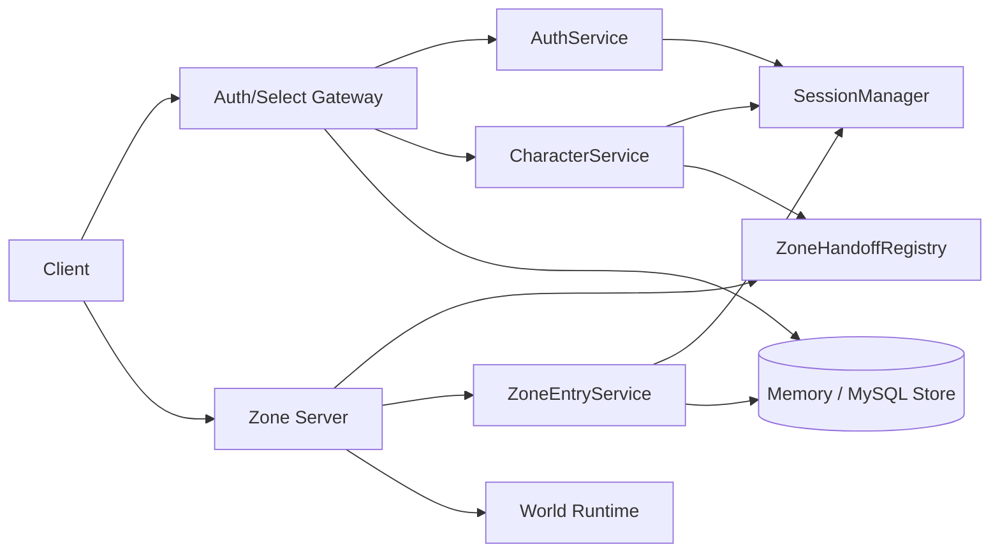
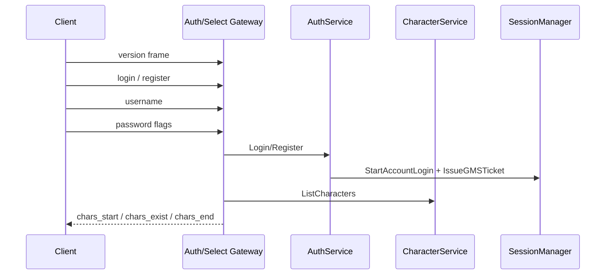
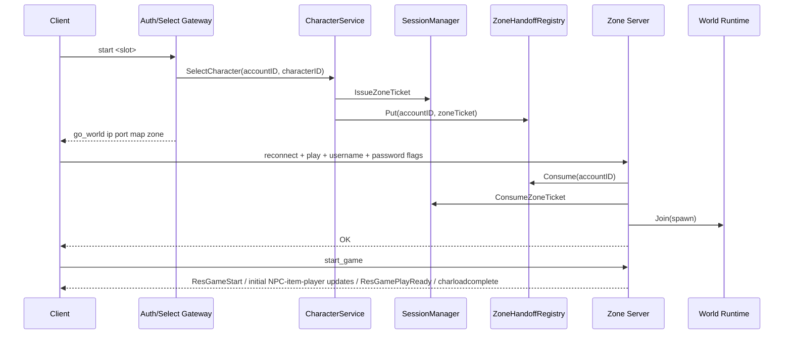
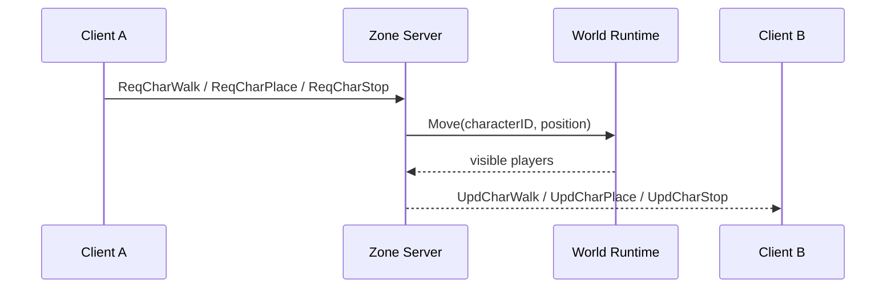

# laghaim-go 项目详细说明文档

## 1. 项目概述

`laghaim-go` 是 Laghaim 服务端栈的 Go 重写项目。当前仓库已经完成了 P0 阶段的基础骨架和一个可运行的开发集群，用于验证客户端可见的登录、选角、进入世界、基础 AOI 与移动广播链路。

项目目标不是简单照搬旧 Python 参考实现，而是根据客户端源码、参考仓库和后续抓包结果，重新拆分服务边界、协议层、会话层、业务层和持久化层，让后续可以逐步扩展为可维护的正式服务端。

当前重点包括：

- 客户端 rnPacket 帧格式解析与生成。
- SEED 传输加密实现。
- 登录、注册、角色列表、建角、删角、选角。
- 服务端内部 session / ticket / zone handoff。
- P0 内存仓储与 MySQL schema 设计。
- Auth/Select Gateway 与 Zone Server 的最小可运行链路。
- 玩家进入世界、静态 NPC/物品下发、同地图同 zone 玩家可见性、移动广播、断线位置保存。

## 2. 项目背景与参考来源

### 2.1 重写背景

旧参考实现中协议解析、连接状态、业务逻辑和持久化耦合较重，且部分协议假设与客户端源码不一致。Go 重写希望先把主链路拆清楚，再逐步补齐游戏玩法。

### 2.2 参考来源

主要参考源：

- Python 参考服务端：`/Users/daidai/ai/laghaim-server`
- 客户端源码：`/tmp/laghaim-client`、`/tmp/laghaim-client-ref`
- 上游客户端仓库：`https://github.com/Topstack-first/20210521_directx_laghaim`

当前项目在协议判断上优先相信客户端源码。Python 参考仓库中的 XOR 传输假设被保留为兼容与逆向笔记，但主实现按客户端 `rnpacket.cpp` 中的 SEED 加密路径推进。

## 3. 当前运行状态

### 3.1 可运行入口

当前真正可运行的是 P0 开发集群：

```bash
go run ./cmd/dev-cluster -config configs/dev.yaml
```

它会启动：

- Auth/Select Gateway：默认 `0.0.0.0:4005`
- Zone Server：默认 `0.0.0.0:4008`

当前 `dev-cluster` 已支持按配置切换 `memory` / `mysql` 仓储后端：

- `storage.backend=memory`：用于纯本地 P0 验证，进程退出即丢数据。
- `storage.backend=mysql`：走 `internal/repo/mysql`，适合接真实 MySQL 持久化。

`cmd/login-server`、`cmd/game-manager`、`cmd/zone-server`、`cmd/admin-web` 当前仍主要是独立进程入口占位，负责加载配置和输出 bootstrap 日志，还没有接入完整服务逻辑。

### 3.2 开发配置

配置文件位于：

```text
configs/dev.yaml
```

主要配置项：

- `environment`：运行环境标识，当前为 `dev`。
- `storage.backend`：仓储后端，当前支持 `memory` / `mysql`。
- `database.dsn`：MySQL 连接串，供 `storage.backend=mysql` 使用。
- `database.max_open_conns` / `max_idle_conns` / `conn_max_lifetime`：连接池配置。
- `session.ticket_ttl`：GMS / Zone ticket 默认有效期，当前为 `2m`。
- `login_server.port`：登录/选角入口端口，当前为 `4005`。
- `game_manager.port`：逻辑 GMS 端口，当前为 `4007`，P0 暂未单独监听。
- `zone_server.port`：世界服端口，当前为 `4008`。
- `zone_server.static_npcs` / `static_items`：开发用静态世界对象配置。
- `admin_web.port`：后台端口，当前为 `8080`。

支持环境变量覆盖：

- `LAGHAIM_ENVIRONMENT`
- `LAGHAIM_STORAGE_BACKEND`
- `LAGHAIM_DATABASE_DSN`
- `LAGHAIM_SESSION_TICKET_TTL`
- `LAGHAIM_LOGIN_SERVER_PORT`
- `LAGHAIM_GAME_MANAGER_PORT`
- `LAGHAIM_ZONE_SERVER_PORT`
- `LAGHAIM_ADMIN_WEB_PORT`

### 3.3 测试命令

```bash
make test
```

`make test` 会依次执行：

- `python3 tools/gen_opcodes.py`
- `gofmt -w ./internal/protocol`
- `gofmt -w ./cmd ./internal`
- `go test ./...`

本地 MySQL / MariaDB 辅助命令：

- `make mysql-init`：启动本地服务（如可检测到）、创建 `laghaim` 库和 `laghaim` 用户。
- `make mysql-migrate-reset`：重置并重放 P0 migration。
- `make mysql-smoke`：跑真实 MySQL 后端的 auth/select/zone 集成 smoke test。

## 4. 总体架构

项目计划拆成 5 个边界明确的系统：

1. LGS：登录服，负责账号认证和登录会话创建。
2. GMS：角色/路由服，负责角色列表、建角、删角、选角和进入世界 handoff。
3. ZS：区域服/世界服，负责在线世界、AOI、移动广播和断线清理。
4. Admin Web：后台管理，负责账号、角色、封禁、公告、日志查询、GM 审计。
5. Platform：配置、日志、迁移、监控、审计等基础设施。

P0 阶段为了快速验证客户端链路，LGS 与 GMS 逻辑共置在 Auth/Select Gateway 中，对客户端表现为一个初始入口。客户端选角后收到 `go_world <ip> <port> <world> <area>`，随后断开并重连 Zone Server。



## 5. 目录结构说明

```text
cmd/
  dev-cluster/       P0 开发集群入口，当前主要运行入口
  login-server/      LGS 独立入口占位
  game-manager/      GMS 独立入口占位
  zone-server/       ZS 独立入口占位
  admin-web/         Admin Web 独立入口占位

configs/
  dev.yaml           本地开发配置

docs/
  architecture.md    架构基线
  database-schema.md MySQL schema 设计
  session-flow.md    session / ticket 流程
  protocol-map.md    协议字典与逆向结论
  admin-scope.md     后台范围说明
  milestones.md      阶段规划

internal/
  protocol/          rnPacket 帧、包头、opcode、SEED、legacy XOR
  session/           session、ticket、互斥登录、状态机
  repo/              仓储接口、数据模型、错误定义
  repo/memory/       P0 内存仓储实现
  repo/mysql/        P0 MySQL 仓储实现
  service/           账号、角色、handoff、进入世界等用例编排
  server/authselect/ Auth/Select Gateway TCP 服务
  server/zone/       Zone Server TCP 服务
  world/             在线玩家 runtime
  game/              游戏规则预留目录
  admin/             后台服务预留目录
  platform/config/   YAML 配置加载与环境变量覆盖
  platform/database/ MySQL 连接池初始化
  platform/logging/  结构化日志封装

migrations/
  000001_p0_core.*   P0 MySQL 建表与回滚脚本

tools/
  gen_opcodes.py     从协议枚举生成 Go opcode 常量

web/
  README.md          管理后台前端预留目录
```

## 6. 核心模块详解

### 6.1 protocol

位置：

```text
internal/protocol/
```

职责：

- 定义客户端 rnPacket 线格式。
- 解析和构造 frame。
- 处理 packet header / subheader。
- 生成并维护 opcode 常量。
- 实现 SEED transport。
- 保留 legacy XOR 对照实现。

rnPacket 当前线格式：

```text
[2-byte little-endian size][8-byte subheader][payload...]
```

关键点：

- `size` 表示 size 字段之后的字节数，即 `8B subheader + payload`。
- 总帧长等于 `2 + size`。
- 文本命令不是裸 TCP 文本，而是 payload 为文本的 rnPacket。
- `BuildTextCommand` 会用全零 subheader 包装文本命令。
- `IsTextCommand` 用于识别登录、选角等控制面文本命令。

Packet type：

| 值 | 含义 |
|---:|---|
| 0 | 文本命令或无类型 |
| 1 | Request，客户端到服务端 |
| 2 | Response，服务端回复 |
| 3 | Update，服务端推送 |

SEED 加密：

- 默认 key 为 32 字节 `0x00` 到 `0x1f`。
- 加密/解密从 frame 的 size 字段之后开始，也就是 subheader + payload。
- 按 SEED block size 处理完整 block，尾部不足一个 block 的字节保持不变。

当前已生成 opcode：

- Request：286 个。
- Response：201 个。
- Update：235 个。

P0 已用到的典型 opcode：

- `ReqCharWalk`
- `ReqCharPlace`
- `ReqCharStop`
- `UpdMapInChar`
- `UpdMapInNpc`
- `UpdMapInItem`
- `UpdMapOut`
- `UpdCharWalk`
- `UpdCharPlace`
- `UpdCharStop`

### 6.2 session

位置：

```text
internal/session/
```

职责：

- 管理账号登录 session。
- 签发 GMS ticket 和 Zone ticket。
- 一次性消费 ticket。
- 处理 ticket 过期、重复消费、类型错误。
- 实现同账号新登录顶旧登录。

核心身份：

| 标识 | 含义 |
|---|---|
| `account_id` | 账号主体 |
| `session_id` | 一次登录链路主体 |
| `character_id` | 进入世界后的角色主体 |

Session phase：

| Phase | 含义 |
|---|---|
| `login` | 账号已开始登录 |
| `gms` | 已进入角色/路由阶段 |
| `zone` | 已进入世界阶段 |
| `closed` | 会话已关闭或被新登录替换 |

Ticket 类型：

- `gms`：绑定 `session_id + account_id`。
- `zone`：绑定 `session_id + account_id + character_id`。

安全原则：

- 客户端传来的账号和角色信息只作为查询参数，不能作为授权凭据。
- Zone Server 进入世界必须消费服务端内部 handoff 对应的 zone ticket。
- ticket 一次性消费，过期后删除。
- 同账号新登录会让旧 session 与旧 ticket 失效。

### 6.3 repo

位置：

```text
internal/repo/
internal/repo/memory/
```

职责：

- 定义领域数据模型。
- 定义仓储接口。
- 提供 P0 内存实现。

当前模型：

- `Account`
- `Character`
- `CharacterStats`
- `Inventory`
- `InventoryItem`
- `Equipment`
- `GMLog`

当前仓储接口：

- `AccountRepository`
- `CharacterRepository`
- `CharacterStatsRepository`
- `InventoryRepository`
- `AuditRepository`

P0 已落地的仓储后端：

### Memory

能力：

- 创建账号。
- 按 ID / username 查询账号。
- 更新登录时间与登录 IP。
- 创建角色。
- 查询账号角色列表。
- 按 ID / name 查询角色。
- 软删除角色。
- 保存角色位置。
- 创建角色数值。
- 创建默认背包、快捷栏、starter 物品实例和默认装备映射。
- 查询背包物品、快捷栏物品和已装备物品。
- 写入 GM 日志。

### MySQL

位置：

```text
internal/repo/mysql/
```

当前能力与内存仓储对齐：

- 账号创建 / 查询 / 登录元数据更新。
- 角色创建 / 查询 / 软删除 / 位置保存。
- 角色数值创建 / 查询。
- 默认背包、快捷栏、starter 物品实例和默认装备映射创建。
- 背包物品、快捷栏物品和已装备物品查询。
- GM 日志写入。

实现细节：

- 使用 `database/sql` + `go-sql-driver/mysql`。
- `dev-cluster` 根据 `storage.backend` 切换 memory / mysql。
- MySQL 版本通过 `characters.active_slot_index` 生成列保证“软删除后槽位可复用”。
- migration 统一使用 `utf8mb4_unicode_ci`，避免本地 MariaDB 无法识别 MySQL 8 专属 collation。

注意：当前环境里是否有可连接的本地 MySQL 实例，不由仓库本身保证；代码层已经接好，但仍需要真实库上的 smoke test。

### 6.4 service

位置：

```text
internal/service/
```

职责：

- 封装应用用例。
- 协调 repo、session 和 handoff。
- 避免 TCP handler 直接写复杂业务逻辑。

当前服务：

#### AuthService

接口：

- `Register(ctx, username, password, remoteIP)`
- `Login(ctx, username, password, remoteIP)`

行为：

- 注册时创建账号，密码使用 argon2id hash。
- 登录时校验账号状态和密码。
- 登录成功后调用 `SessionManager.StartAccountLogin`。
- 签发 GMS ticket。
- 更新 `last_login_at` 和 `last_login_ip`。

#### CharacterService

接口：

- `ListCharacters(ctx, accountID)`
- `IsNameAvailable(ctx, name)`
- `CreateCharacter(ctx, request)`
- `DeleteCharacter(ctx, accountID, characterID)`
- `SelectCharacter(ctx, accountID, characterID)`

行为：

- 角色列表会聚合 `characters` 与 `character_stats`。
- 建角会检查名称、槽位和数量限制。
- 默认最多 5 个角色。
- 默认出生点为 `map_id=1`、`zone_id=0`、`pos_x=33000`、`pos_z=33000`。
- 默认初始金钱为 `1000`。
- 建角后创建初始数值、默认背包、默认快捷栏、starter 物品实例和默认装备映射。
- 角色列表中的 wearing 字段会从真实装备映射聚合，不再固定返回全 0。
- 选角时签发 Zone ticket，并登记到 `ZoneHandoffRegistry`。

#### ZoneHandoffRegistry

职责：

- 以 `accountID -> zoneTicket` 形式保存短期内部 handoff。
- Zone Server 在玩家二次 `play` 登录后消费 handoff。
- 当前是内存实现，适合单进程/单服组 P0。

#### ZoneEntryService

接口：

- `EnterWorld(ctx, zoneTicket)`
- `SaveLogoutPosition(ctx, characterID, mapID, zoneID, posX, posY, posZ, direction)`

行为：

- 消费 Zone ticket。
- 根据 ticket 绑定的角色加载角色数据、数值、背包物品、快捷栏物品和装备快照。
- 返回世界服创建在线实体所需的 spawn 信息。
- 返回用于自身 `wearing` 文本命令和其他玩家 `UpdMapInChar` 的装备快照。
- 断线时保存角色最后位置。

### 6.5 Auth/Select Gateway

位置：

```text
internal/server/authselect/
```

职责：

- 监听客户端初始连接。
- 处理登录、注册、选角阶段文本命令。
- 调用 AuthService 和 CharacterService。
- 下发角色列表。
- 选角成功后下发 `go_world`。

当前支持命令：

| 命令 | 说明 |
|---|---|
| `login` | 开始登录流程 |
| `register` | 开始注册流程 |
| `<username>` | 登录/注册第二行，用户名 |
| `<password> <flags...>` | 登录/注册第三行，当前只取第一个字段作为密码 |
| `char_exist <name>` | 检查角色名是否可用 |
| `char_new ...` | 创建角色 |
| `char_del ...` | 删除角色 |
| `start <slot>` | 选择角色并请求进入世界 |
| `chars` | 重新获取角色列表 |

登录成功后角色列表响应：

```text
chars_start
chars_exist ...
chars_end 0 0
```

选角成功后响应：

```text
go_world <zone_host> <zone_port> <map_id> <zone_id>
```

错误响应统一为：

```text
fail <reason>
```

典型错误码：

- `unexpected_command`
- `invalid_credentials`
- `account_exists`
- `bad_char_new`
- `bad_char_del`
- `name_taken`
- `slot_taken`
- `char_limit`
- `char_not_found`
- `unknown_command`
- `internal_error`

### 6.6 Zone Server

位置：

```text
internal/server/zone/
```

职责：

- 监听客户端世界服连接。
- 处理 `play -> username -> password flags` 文本登录。
- 校验账号密码。
- 消费内部 zone handoff。
- 创建在线玩家。
- 下发初始可见 NPC、物品、玩家。
- 广播玩家进入、离开和移动。
- 断线时保存位置。

世界服进入流程：

1. 客户端连接 Zone Server。
2. 客户端发送版本号帧，服务端忽略纯数字行。
3. 客户端发送 `play` 或 `login`。
4. 客户端发送 username。
5. 客户端发送 password flags。
6. 服务端校验账号密码。
7. 服务端通过 accountID 消费 `ZoneHandoffRegistry` 中的 zone ticket。
8. `ZoneEntryService.EnterWorld` 消费 ticket 并加载角色。
9. `World.Runtime.Join` 创建在线玩家。
10. 服务端返回文本 `OK`。
11. 客户端发送 `start_game`。
12. 服务端返回 `ResGameStart`、初始 NPC / Item / Player 可见集、`ResGamePlayReady`、`charloadcomplete`。
13. 服务端向同地图同 zone 其他玩家广播新玩家进入。

当前处理的 typed packet：

| Opcode | 行为 |
|---|---|
| `ReqCharWalk` | 解码移动目标，更新 runtime，广播 `UpdCharWalk` |
| `ReqCharPlace` | 解码位置/方向/跑动状态，广播 `UpdCharPlace` |
| `ReqCharStop` | 解码停止位置/方向，广播 `UpdCharStop` |
| `ReqItemPick` | 保留最小 typed 拾取兼容路径：返回已校准的 `ResItemPick`，广播已校准的 `UpdItemPick` |
| `ReqItemDrop` | 保留最小 typed 丢弃兼容路径：广播已校准的 `UpdItemDrop` |
| `ReqWear` | 保留最小 typed 穿戴兼容路径：当前按客户端定义只解 `nWearWhere` |

但**客户端可见运行时物品 / 装备主链路已经切到文本命令**：`pick / inven / wear / drop`。

进入世界后的初始化链路当前为：

1. 客户端完成 `play -> username -> password flags`。
2. 服务端校验账号密码并消费内部 handoff。
3. 服务端返回文本 `OK`。
4. 客户端发送 `start_game`。
5. 服务端返回 typed `ResGameStart`。
6. 服务端下发玩家自身初始化文本命令：
   - `at`
   - `status`（HP/MP/体力/EP/等级/金钱/经验/属性点/五维）
   - `wearing`
   - `lp`
   - `init_inven`
   - `inven`
   - `quick`
7. 其中 `wearing`、`inven`、`quick` 均来自仓储中的真实装备/物品数据。
8. 服务端下发初始 NPC / Item / Player 可见集；玩家可见包 `UpdMapInChar` 会带当前装备 vnum。
9. 服务端返回 typed `ResGamePlayReady`。
10. 服务端返回文本 `charloadcomplete`，客户端恢复正常发包。

当前静态世界数据已经从 `cmd/dev-cluster/main.go` 的硬编码迁移到 `configs/dev.yaml`：

- NPC：`Index=10001`、`VNUM=2001`、`map_id=1`、`zone_id=0`、坐标约 `33100,33100`。
- Item：`Index=20001`、`ItemVNUM=5001`、`map_id=1`、`zone_id=0`、坐标约 `32950,32950`。

### 6.7 world

位置：

```text
internal/world/
```

职责：

- 管理在线玩家实体。
- 按 `map_id + zone_id` 计算可见玩家。
- 提供进入、离开、移动和快照。

当前实现是最小 runtime：

- `Join`：加入在线玩家，并返回同地图同 zone 的已在线玩家。
- `Leave`：移除在线玩家，并返回仍可见的玩家。
- `Move`：更新玩家位置，并返回需要广播的可见玩家。
- `UpdateWearings`：更新在线玩家装备展示快照，并返回需要广播的可见玩家。
- `Snapshot`：获取某地图/zone 的玩家快照。

当前尚未实现：

- 网格化 AOI。
- NPC AI。
- 地图实例管理。
- 战斗临时态。
- 完整掉落生命周期。
- 跨地图/跨 zone 迁移。

### 6.8 最小物品闭环

当前已经打通一条 P0 级别的物品闭环，但需要分成 **typed 校准层** 和 **客户端可见文本层** 两部分来看：

1. 地面物品：Zone Server 启动时把 `configs/dev.yaml` 中的静态物品加载为在线地面物品。
2. 客户端可见请求：已补上 `pick <itemIndex>`、`inven <pack> <x> <y>`、`wear <where>`、`drop 1`。
3. 客户端可见响应 / 广播：已补上 `pick ...`、`drop ...`、`out i <itemIndex>`、`pickup <charIndex>`、`char_wear ...`、`char_remove ...`。
4. typed 校准：`ResponseItemPick / UpdateItemDrop / UpdateItemPick / UpdateCharWear` 已按客户端 struct 修正，便于继续抓包比对。

当前剩余的主要风险：

- `quick` 运行时写链路还没补，当前只有 bootstrap。
- 背包复杂交换（目标格已有物品）仍未完整对齐客户端 UI 状态机。
- `ev_wear` 事件服装未实现。
- 还没抓包确认文本与 typed 这两条链路在正式客户端里到底如何混用。
- 物品堆叠、形状占格、绑定、掉落保护、拾取权限、装备限制等仍未完整实现。
- 物品操作在 MySQL 后端还不是完整事务闭环，异常中断时可能出现局部写入成功。
- 失败分支多数还没有明确回包，真实客户端可能需要服务端发送失败文本或 typed result 才能回滚 UI。

### 6.9 platform

位置：

```text
internal/platform/
```

当前包含：

- `config`：读取 YAML 配置，并应用环境变量覆盖。
- `database`：初始化 MySQL 连接池。
- `logging`：创建结构化 logger。

后续建议继续放入：

- metrics。
- tracing。
- rate limit。
- audit helper。
- database connector。
- migration runner。

## 7. 数据库设计

当前 migration：

```text
migrations/000001_p0_core.up.sql
migrations/000001_p0_core.down.sql
```

P0 已覆盖表：

- `accounts`
- `characters`
- `character_stats`
- `inventories`
- `inventory_items`
- `equipments`
- `gm_logs`

### 7.1 accounts

用途：账号主表。

关键字段：

- `username`：唯一用户名。
- `password_hash`：密码 hash。
- `password_algo`：密码算法，默认 `argon2id`。
- `status`：账号状态，默认 `active`。
- `gm_role`：GM 角色，默认 `player`。
- `last_login_at`、`last_login_ip`：最近登录信息。

### 7.2 characters

用途：角色主表。

关键字段：

- `account_id`：所属账号。
- `slot_index`：角色槽位。
- `active_slot_index`：由 `is_deleted` 派生的生成列，只对未删除角色参与唯一约束，用来保证软删除后槽位仍可复用。
- `name`：角色名，全局唯一。
- `race`、`sex`、`hair`：外观基础字段。
- `level`、`experience`：等级经验。
- `map_id`、`zone_id`、`pos_x`、`pos_y`、`pos_z`、`direction`：最后位置。
- `money`：金钱。
- `is_deleted`：软删除标记。
- `row_version`：并发控制版本。

### 7.3 character_stats

用途：角色数值块。

关键字段：

- `strength`
- `intelligence`
- `dexterity`
- `constitution`
- `charisma`
- `hp` / `max_hp`
- `mp` / `max_mp`
- `stamina` / `max_stamina`
- `epower` / `max_epower`
- `skill_points`
- `status_points`
- `row_version`

### 7.4 inventories / inventory_items / equipments

用途：

- `inventories` 定义角色容器，例如背包、快捷栏。
- `inventory_items` 保存物品实例。
- `equipments` 保存装备位到物品实例的映射。

当前设计已经为后续物品、装备、强化、耐久、特殊属性和 JSON 扩展字段留出空间。

### 7.5 gm_logs

用途：后台和 GM 操作审计。

关键字段：

- `operator_account_id`
- `target_account_id`
- `target_character_id`
- `action`
- `reason`
- `request_ip`
- `payload_json`
- `created_at`

## 8. 客户端可见主流程

### 8.1 登录与选角



### 8.2 选角进入世界



### 8.3 移动广播



## 9. 安全与一致性约束

当前设计的关键约束：

- 不信任客户端自报 `account_id`。
- 不信任客户端自报 `character_id`。
- 进入 Zone Server 必须依赖服务端内部 handoff。
- Zone ticket 绑定账号、session 和角色。
- ticket 一次性消费。
- 同账号新登录会替换旧 session。
- 删除角色必须校验角色属于当前账号。
- 角色列表只返回未软删除角色。
- 断线时保存当前位置。
- 拾取、丢弃、装备都会校验在线状态和角色物品归属。
- 装备映射会校验物品属于当前角色，避免跨角色挂装备。

需要注意的 P0 限制：

- Handoff 当前是内存 map，不适合多进程或多机器部署。
- `storage.backend=memory` 时数据不会持久化；`mysql` 已实现，但仍需要真实库 smoke test。
- 当前 world runtime 只按 `map_id + zone_id` 做全量可见判断，还不是正式 AOI。
- 当前账号登录只校验 active 状态，封禁和风控策略尚未完整实现。
- 当前世界服登录仍会再次校验账号密码，这是为了兼容客户端二次 `play` 流程。
- 当前拾取 / 丢弃 / 装备闭环已按客户端源码校准关键 typed Response / Update 包体，但真实客户端到底走文本、typed、还是混用，仍必须以实机抓包为准。

## 9.1 当前风险分层

下面这张表是“开真实客户端前”的风险地图，优先处理高风险项；中低风险可以在实测时边抓边补。

| 等级 | 风险点 | 当前证据 | 建议动作 |
| --- | --- | --- | --- |
| 高 | 文本链路与 typed 链路混用未定 | Zone Server 同时支持 `pick/inven/wear/drop` 文本路径和 `ReqItemPick/ReqItemDrop/ReqWear` typed 兼容路径 | 开客户端后逐包记录请求、响应、广播顺序，不要只看是否“表面能动” |
| 高 | 背包 cursor 状态机简化 | 当前只用 `state.cursorItemID` 表示手上物品 | 专门测试拿起、放下、取消、跨 pack、目标格占用、窗口关闭、断线重连 |
| 高 | 物品操作事务边界不完整 | MySQL 后端部分多步骤操作不是同一事务 | 后续把拾取、移动、装备、建角 starter 初始化收敛成 repo/service 级原子操作 |
| 高 | 失败分支回包未知 | 当前很多失败分支静默返回 | 抓背包满、目标格占用、装备条件不满足、地面物不存在时客户端实际需要的回滚包 |
| 中 | `quick` / `ev_wear` 缺运行时链路 | 目前只有 quickbar bootstrap，未实现运行时变更 | 先补 `quick <slot>` 最小持久化，再确认事件服装协议 |
| 中 | 地面物品只在内存 | `groundItems` 是 Zone Server 内存 map | P0 可用；正式前需要持久化掉落池、掉落保护和重启恢复策略 |
| 中 | AOI / 广播范围过粗 | 当前按 `map_id + zone_id` 全量广播 | 客户端打通后再引入网格 AOI，避免过早复杂化 |
| 中 | 部署入口仍偏 dev-cluster | 完整链路主要在 `cmd/dev-cluster` | 客户端测试先固定单进程；分布式入口后续再拆 |
| 低 | 日志追溯不足 | 目前主要是 stdout 结构化日志 | 开客户端前建议补 `gateway / zone / protocol / item` 分类日志 |
| 低 | MySQL smoke 仍依赖真实环境 | migration 和 repo 已有，但要看实际库版本 | 用真实 MySQL/MariaDB 跑 migration、建角、进图、物品闭环 smoke |

## 9.2 客户端实测检查表

开客户端联调时建议按下面顺序抓包/看日志：

1. 登录/选角：确认 `login/register/play/start/start_game` 是否仍是文本命令帧，以及 `OK / ResGameStart / charloadcomplete` 是否能驱动客户端进入世界。
2. 进图初始化：确认 `status / wearing / init_inven / inven / quick` 文本是否被客户端接受，是否还缺少 `UpdateMyCharWearing` 或其他自身初始化包。
3. 地面物品：确认 `UpdateMapInItem` 字段顺序和物品显示是否正确。
4. 拾取：重点抓 `pick` 文本成功后的真实返回序列：`out / pick / pickup / ResItemPick` 是否混用。
5. 丢弃：确认普通背包丢弃实际发送的是 `drop 1`、`ReqItemDrop`、`ReqInven`、还是其他 opcode。
6. 装备：确认运行时主路径到底是 `wear <where>` 还是 typed `ReqWear`，以及失败分支如何回包。
7. 可见广播：确认 `char_wear / char_remove / out / pickup` 是否足够让其他客户端正确刷新模型与地面物；typed `UpdateCharWear / UpdateItemPick / UpdateItemDrop` 是否仍会出现。
8. 断线回归：确认断线重连后位置、背包、quickbar、wearing 都从持久化恢复。
9. 异常路径：专门测试背包满、重复拾取同一个地面物、拖到占用格、装备空 cursor、丢弃空 cursor、断线后重进，确认客户端 UI 不会卡住。

## 10. 已完成能力清单

已完成：

- Go 项目骨架。
- 基础设计文档。
- rnPacket frame 编解码。
- opcode 生成脚本与 Go 常量。
- SEED transport 实现。
- legacy XOR 对照包。
- 更细的 typed 请求 / 响应 / update 结构体定义（含世界初始化与移动相关包体）。
- SessionManager 与单测。
- P0 MySQL migration。
- 内存仓储。
- MySQL 仓储实现。
- `dev-cluster` 的 `memory` / `mysql` 可切换仓储后端。
- AuthService。
- CharacterService。
- ZoneEntryService。
- ZoneHandoffRegistry。
- Auth/Select Gateway。
- Zone Server。
- 进入世界后的 `OK -> start_game -> ResGameStart -> 初始更新 -> ResGamePlayReady -> charloadcomplete` 初始化握手。
- P0 dev-cluster。
- 基础世界 runtime。
- 玩家进入、离开、移动广播。
- 静态 NPC 和静态物品改为配置驱动下发。
- 最小拾取、丢弃、装备闭环。
- 断线位置保存。
- Gateway / Zone 集成测试覆盖更多异常链路。

## 11. 当前未完成与后续建议

优先级较高：

- 用实机客户端或抓包确认 LGS/GMS/ZS 各阶段真实帧形态，并验证当前 `OK / start_game / charloadcomplete` 假设是否与真机一致。
- 在真实 MySQL 实例上跑 migration + smoke test，确认 `internal/repo/mysql` 与连接池配置在实际数据库上工作正常。
- 继续补齐进入世界后的必要初始化包体，尤其是“玩家自身初始化态 / 数值 / 背包 / UI 依赖包”的真实最小集合。
- 视抓包结果决定是否需要把更多登录/进图命令从文本帧迁移到 typed packet。
- 把物品闭环从“成功路径可跑”推进到“失败路径可回滚”，优先覆盖背包满、格子占用、重复拾取、装备条件失败。
- 给 `quick` 增加运行时持久化写链路，并确认快捷栏拖拽是否只发文本 `quick <slot>`。

中期建议：

- 实现正式 AOI 网格。
- 实现地图实例和跨地图跳转。
- 实现背包、装备、拾取、丢弃、商店。
- 实现战斗、技能、NPC AI。
- 实现 GM 后台 API、RBAC 和审计查询。
- 增加 metrics、pprof、连接数、在线人数、地图人数统计。
- 增加 graceful shutdown，确保断线落盘和在线态清理稳定。

长期建议：

- 支持多 Zone Server。
- 引入服务发现或静态路由表。
- 设计跨服 session / handoff 存储，例如 Redis。
- 完善经济流水、物品流水和高风险操作审计。
- 引入压测和客户端兼容性回归测试。

## 12. 开发注意事项

### 12.1 协议优先级

协议结论优先级：

1. 客户端源码。
2. 抓包结果。
3. 旧服务端参考实现。
4. 推测。

如果 Python 参考实现与客户端源码冲突，应优先按客户端源码修正。

### 12.2 不要破坏的边界

后续开发应尽量保持：

- TCP handler 只负责连接、帧读取、命令分发和响应写回。
- 业务规则放在 `internal/service` 或未来的 `internal/game`。
- 持久化只通过 `internal/repo` 接口。
- 在线临时态放在 `internal/world`。
- 跨服身份流转只通过 `internal/session` 和 handoff。

### 12.3 当前最容易踩坑的点

- 文本命令也必须走 rnPacket frame，不是裸文本。
- `size` 字段不是总包长，而是 subheader + payload 长度。
- Response / Update opcode 不是连续从 Request 后面顺排。
- 客户端当前没有显式携带 zone ticket，ticket 是服务端内部概念。
- P0 的 `go_world` 参数使用的是服务端告诉客户端的 host/port/map/zone，不代表客户端拥有授权。
- `storage.backend=memory` 时数据存在内存里，重启会丢；切到 `mysql` 前记得先跑 migration。

## 13. 快速上手

1. 拉起开发集群：

```bash
go run ./cmd/dev-cluster -config configs/dev.yaml
```

2. 运行测试：

```bash
make test
```

3. 修改协议 opcode 后重新生成：

```bash
make generate
```

4. 初始化本地 MySQL（可选）：

```bash
make mysql-init
make mysql-migrate-reset
```

5. 切换到 MySQL（可选）：

```yaml
storage:
  backend: mysql
```

并通过环境变量覆盖 DSN，例如：

```bash
export LAGHAIM_DATABASE_DSN="$(bash scripts/mysql-local.sh dsn)"
```

或者直接用辅助脚本启动：

```bash
make dev-cluster-mysql
```

6. 格式化代码：

```bash
make fmt
```

## 14. 一句话总结

当前项目已经不是单纯的脚手架，而是具备 P0 客户端主链路验证能力的 Go 服务端重写基线。它已经把登录、选角、服务端内部 ticket、进入世界、基础可见性和移动广播串起来了；下一阶段的核心工作，是把内存原型替换成可持久化、可观测、可扩展的正式服务端能力。
