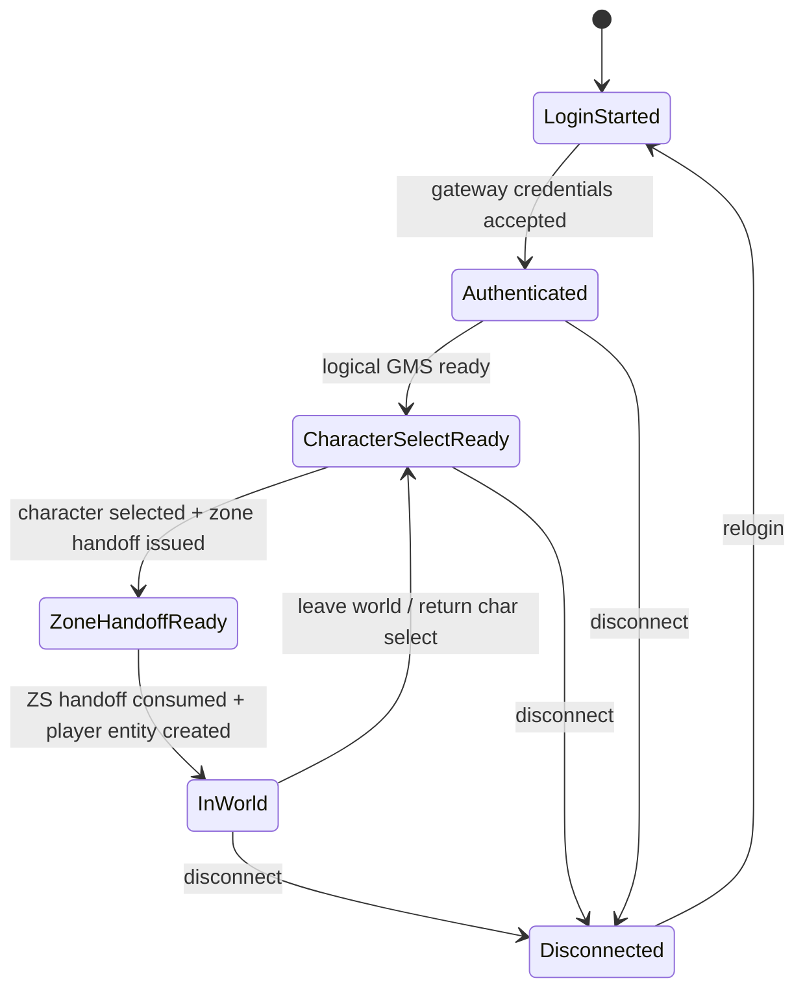
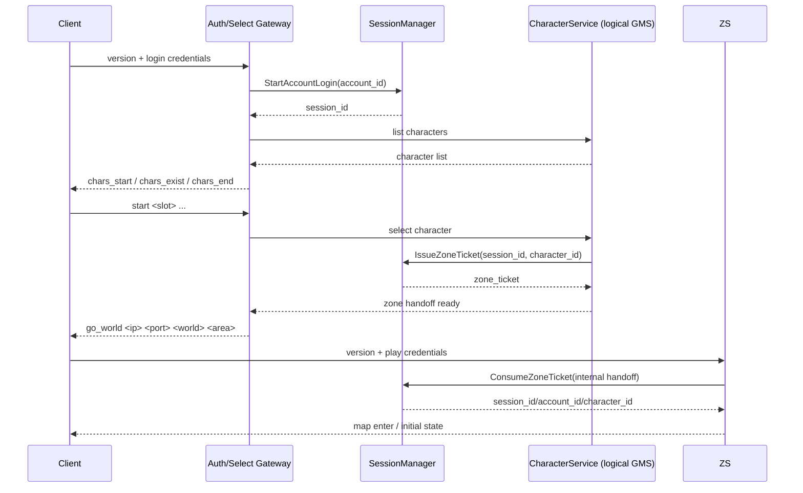

# Session / Ticket 流程

## 核心身份

| 标识 | 含义 | 允许出现的位置 |
|---|---|---|
| `account_id` | 账号主体 | LGS / GMS / Admin / Repo |
| `session_id` | 一次登录链路主体 | LGS / GMS / ZS / SessionManager |
| `character_id` | 进入世界后的角色主体 | GMS / ZS / Repo / Admin |

原则：

- `account_id` 不能直接代表已通过跨服认证
- `character_id` 不能脱离 `session_id` 单独信任
- 客户端传来的账号/角色信息只能当“查询参数”，不能当“授权凭证”

## 状态机

## 正常链路

### 逻辑链路

### 客户端可见链路

当前客户端源码显示，客户端并**不会显式携带 ticket 到 ZS**；它会在 `go_world` 后重新连世界服，并再次发送 `play -> username -> password flags`。

因此 P0 的兼容实现应当：

- 保持 **ticket 在服务端内部存在**
- 由 gateway 在选角成功时登记一个短 TTL 的内部 zone handoff
- 由 ZS 在 `play` 登录成功后消费该 handoff，而不是信任客户端自报角色身份

## Ticket 规则

### GMS ticket

- 由 LGS 签发
- 绑定 `session_id + account_id`
- 短 TTL（建议 30s~120s）
- 一次性消费
- 被新登录替换后立即失效

### ZS ticket

- 由 GMS 签发
- 绑定 `session_id + account_id + character_id`
- 短 TTL（建议 30s~120s）
- 一次性消费
- 角色切换或新登录后失效

## 互斥登录策略

### 默认策略：新登录顶旧登录

优先保证最新一次登录是合法持有者。

规则：

1. 同账号新登录成功时，旧 `session_id` 立刻失效
2. 旧 session 上未消费 ticket 一律失效
3. 旧 session 若还在 ZS，收到踢线原因码后清理在线态
4. 只有最新 session 可以继续签发新 ticket

## 重连规则

### P0 简化重连

P0 不做复杂断线保活，只做：

- 断线时 ZS 立刻清在线实体
- 最后坐标、地图、朝向落盘
- 客户端重新从 gateway -> 选角 -> `go_world` -> ZS 走全链路

### P1 可选增强

- 增加短暂 reconnect token
- 限时回收在线态
- 避免战斗中瞬断直接丢失上下文

## 服务端必须拒绝的场景

1. 直接连世界服并自报 `character_id`
2. 没有有效内部 handoff 就试图进入 ZS
3. 使用过期 ticket
4. 重复消费同一 ticket
5. 用 A 账号会话访问 B 账号角色
6. 新登录已经替换旧 session 后，旧连接继续请求写操作

## 落地到当前代码

已落地基础实现：

- `internal/session/manager.go`
  - `StartAccountLogin`
  - `IssueGMSTicket`
  - `IssueZoneTicket`
  - `ConsumeGMSTicket`
  - `ConsumeZoneTicket`
  - 单账号新登录替换旧 session

对应单测：

- `internal/session/manager_test.go`
  - ticket 一次性消费
  - ticket 过期
  - 新登录使旧 ticket 失效
  - ZS ticket 绑定角色 ID
